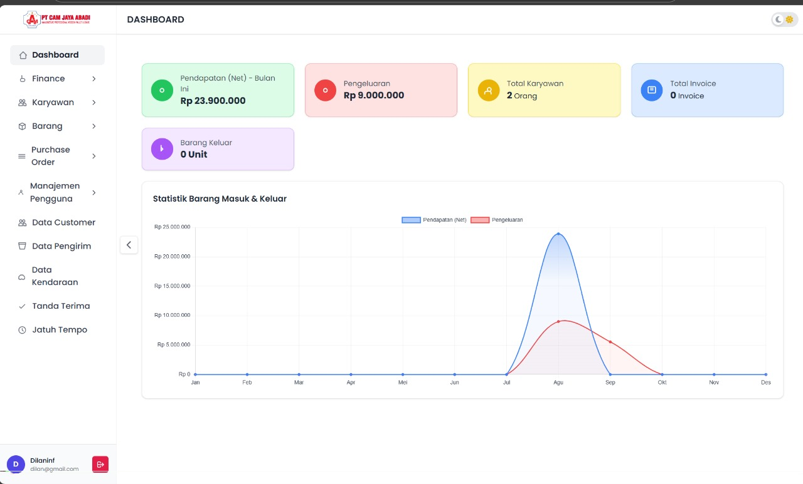
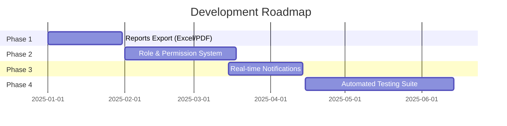

<div align="center">

# 🏢 Manajemen Perusahaan

<p align="center">
  
</p>

### ✨ Aplikasi Manajemen Operasional Perusahaan Modern

<p align="center">
  
  
  
  
  
</p>

<p align="center">
  
  
  
</p>

---

</div>

## 📋 Daftar Isi

- [🎯 Fitur Utama](#-fitur-utama)
- [🖼️ Preview](#️-preview)
- [🛠️ Tech Stack](#️-tech-stack)
- [⚡ Quick Start](#-quick-start)
- [🎨 UI/UX Highlights](#-uiux-highlights)
- [📚 API Routes](#-api-routes)
- [🔧 Troubleshooting](#-troubleshooting)
- [🗺️ Roadmap](#️-roadmap)
- [🤝 Contributing](#-contributing)

## 🎯 Fitur Utama

<table>
<tr>
<td width="50%">

### 📦 **Purchase Order Management**
- ✅ Daftar PO dengan pencarian canggih
- ✅ Form tambah/edit PO yang intuitif
- ✅ Tracking status PO real-time

### 📄 **Surat Jalan Digital**
- ✅ Generate surat jalan otomatis
- ✅ Template yang dapat dikustomisasi
- ✅ Export ke PDF

### 💰 **Financial Management**
- ✅ Laporan pendapatan bulanan
- ✅ Tracking pengeluaran
- ✅ Dashboard keuangan interaktif

</td>
<td width="50%">

### 👥 **Master Data Management**
- ✅ Database pelanggan terintegrasi
- ✅ Manajemen karyawan
- ✅ Katalog produk & inventory
- ✅ Data kendaraan & pengirim

### 🔐 **Security & Authentication**
- ✅ Login system yang aman
- ✅ Role-based access control
- ✅ Session management

### 📊 **Reporting & Analytics**
- ✅ Dashboard dengan visualisasi data
- ✅ Export laporan (Excel/PDF)
- ✅ Real-time analytics

</td>
</tr>
</table>

## 🖼️ Preview

<div align="center">
  
  
  *Dashboard dengan UI modern dan responsif*
</div>

## 🛠️ Tech Stack

<div align="center">

| **Backend** | **Frontend** | **Database** | **Tools** |
|-------------|--------------|--------------|-----------|
|  |  |  |  |
|  |  |  |  |
| |  | |  |

</div>

## ⚡ Quick Start

### 📋 Prerequisites

```bash
✅ PHP 8.2+
✅ Composer 2+
✅ Node.js 18+ & NPM
✅ MySQL/MariaDB
```

### 🚀 Installation

```bash
# 1️⃣ Clone repository
git clone https://github.com/DillanINF/Manajemen-perusahaan.git
cd Manajemen-perusahaan

# 2️⃣ Install dependencies
composer install
npm install

# 3️⃣ Environment setup
cp .env.example .env
php artisan key:generate

# 4️⃣ Database setup
php artisan migrate
php artisan db:seed  # Optional

# 5️⃣ Build assets
npm run dev  # Development
# npm run build  # Production

# 6️⃣ Start server
php artisan serve
```

### ⚙️ Environment Configuration

```ini
APP_NAME="Manajemen Perusahaan"
APP_ENV=local
APP_DEBUG=true
APP_URL=http://localhost:8000

DB_CONNECTION=mysql
DB_HOST=127.0.0.1
DB_PORT=3306
DB_DATABASE=cam_db
DB_USERNAME=root
DB_PASSWORD=your_password
```

## 🎨 UI/UX Highlights

<div align="center">

### ✨ **Modern Interface Design**

</div>

| Feature | Description |
|---------|-------------|
| 🎯 **Smart Sidebar** | Sticky header/footer dengan smooth scrolling |
| 🎭 **Smooth Animations** | Alpine.js transitions untuk pengalaman yang halus |
| 📱 **Responsive Design** | Mobile-first approach dengan hamburger menu |
| 🎨 **Consistent Icons** | Icon system yang seragam dan scalable |
| ⚡ **Quick Access** | One-click access ke pengaturan dari sidebar footer |

## 📚 API Routes

<details>
<summary><b>🔗 Click to expand routes</b></summary>

### 🏠 **Core Routes**
```php
GET  /dashboard              # Main dashboard
GET  /settings              # User settings
```

### 📦 **Purchase Order**
```php
GET  /po                    # PO listing
POST /po                    # Create PO
GET  /po/{id}/edit          # Edit PO form
PUT  /po/{id}               # Update PO
```

### 📄 **Surat Jalan**
```php
GET  /suratjalan            # Surat jalan listing
POST /suratjalan            # Generate surat jalan
```

### 💰 **Financial Reports**
```php
GET  /finance/income        # Income report (?inc_month=8&inc_year=2025)
GET  /finance/income/detail # Income details (JSON)
GET  /finance/expense       # Expense report (?month=8&year=2025)
GET  /finance/expense/detail# Expense details (JSON)
```

</details>

## 🔧 Troubleshooting

<details>
<summary><b>🛠️ Common Issues & Solutions</b></summary>

### 🚨 **Sidebar Issues**
```bash
Problem: Sidebar tidak sticky
Solution: Pastikan <aside id="sidebar"> memiliki overflow-hidden
```

### 🎯 **Icon Problems**
```bash
Problem: Icon panah mengecil
Solution: Gunakan classes: min-w-[1rem] min-h-[1rem] shrink-0 flex-none
```

### ⚙️ **Settings Access**
```bash
Problem: Klik profil tidak membuka pengaturan
Solution: Pastikan footer profil dibungkus <a href="{{ route('settings') }}">
```

### 🎭 **Animation Issues**
```bash
Problem: Animasi pengaturan tidak muncul
Solution: Cek kondisional request()->routeIs('settings')
```

### 📦 **Build Problems**
```bash
Problem: Vite build gagal
Solution: rm -rf .vite node_modules && npm install
```

</details>

## 🗺️ Roadmap

<div align="center">

### 🎯 **Coming Soon**

</div>



- [ ] 📊 **Advanced Reporting** - Export Excel/PDF dengan template kustom
- [ ] 👥 **Role Management** - Sistem permission yang granular
- [ ] 🔔 **Real-time Notifications** - WebSocket integration
- [ ] 🧪 **Testing Suite** - Comprehensive testing dengan Pest/PHPUnit
- [ ] 📱 **Mobile App** - React Native companion app
- [ ] 🤖 **API Integration** - RESTful API untuk third-party integration

## 🤝 Contributing

<div align="center">

### 💝 **We Welcome Contributors!**

</div>

```bash
# 1️⃣ Fork the repository
# 2️⃣ Create feature branch
git checkout -b feature/amazing-feature

# 3️⃣ Commit changes (follow conventional commits)
git commit -m "feat(ui): add amazing feature"

# 4️⃣ Push to branch
git push origin feature/amazing-feature

# 5️⃣ Open Pull Request
```

### 📝 **Commit Convention**
- `feat(scope):` ✨ New features
- `fix(scope):` 🐛 Bug fixes  
- `docs(scope):` 📚 Documentation
- `style(scope):` 💄 Code style
- `refactor(scope):` ♻️ Code refactoring
- `chore(scope):` 🔧 Maintenance

---

<div align="center">

### 📄 **License**

This project is licensed under the **MIT License** - see the [LICENSE](LICENSE) file for details.

### 💖 **Made with Love**

Built with ❤️ by [DillanINF](https://github.com/DillanINF)

<p align="center">
  
</p>

</div>
