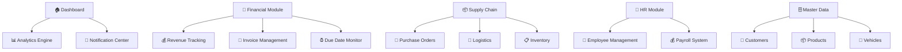
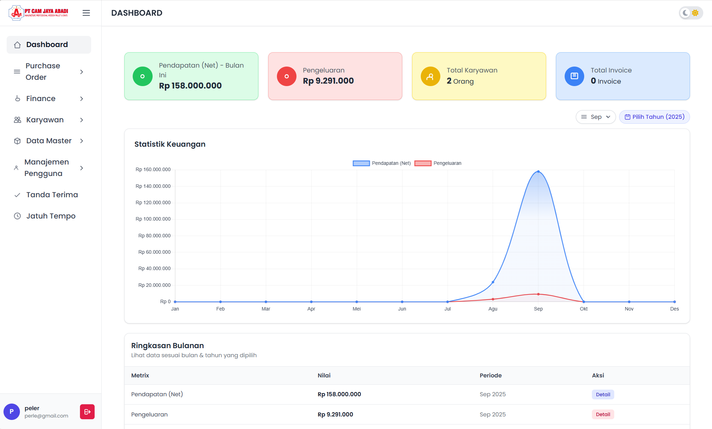
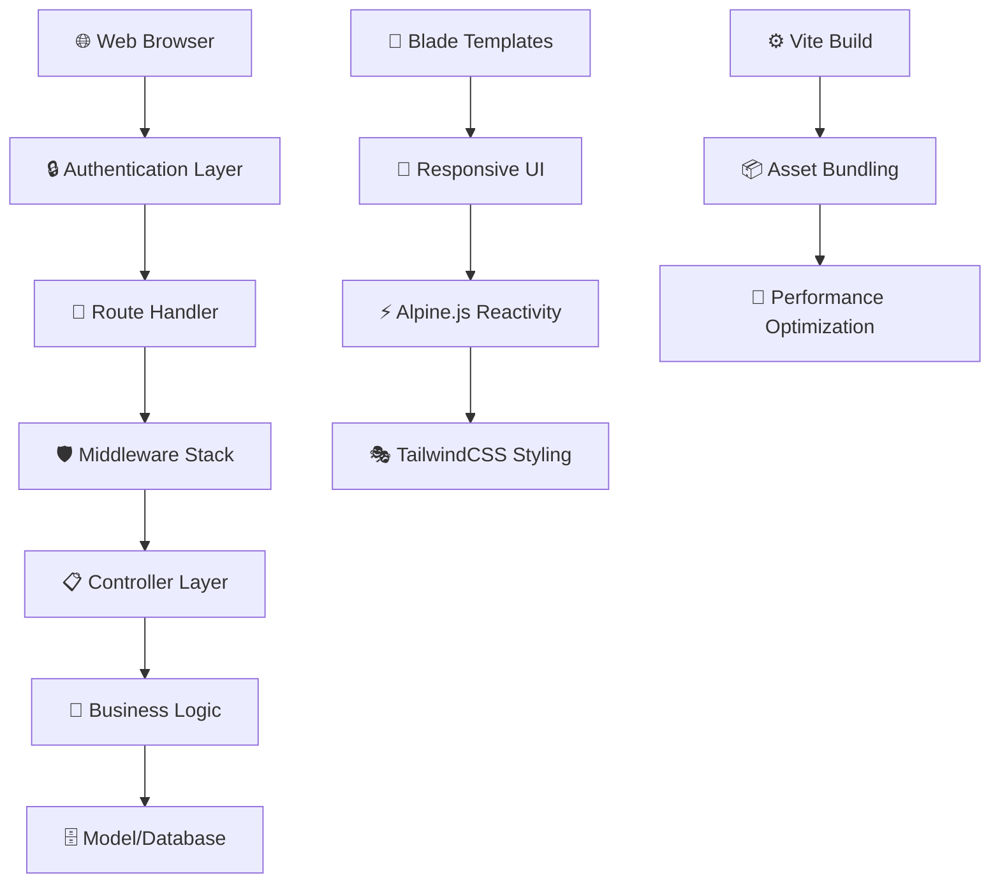
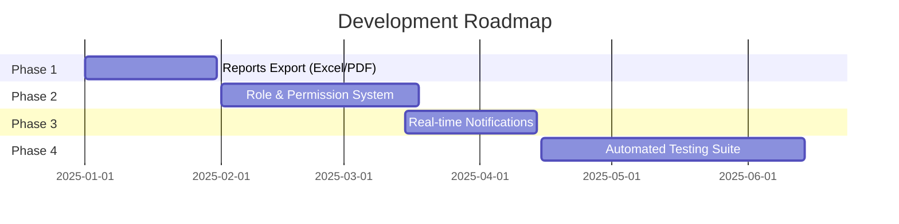

<div align="center">

# 🏢 Sistem Manajemen Perusahaan Terpadu

<p align="center">
  
</p>

### ✨ Solusi Manajemen Operasional Perusahaan Modern & Terintegrasi

<p align="center">
  
  
  
  
  
  
</p>

<p align="center">
  
  
  
  
</p>

<p align="center">
  
  
  
  
</p>

---

</div>

## 🎯 Ringkasan Eksekutif

<div align="center">

### 🚀 **Transformasi Digital untuk Operasional Perusahaan**

</div>

<table>
<tr>
<td width="50%" align="center">

#### 🎯 **Tujuan Utama**
Sistem manajemen operasional **end-to-end** untuk perusahaan distribusi, logistik, dan manufaktur dengan fokus pada **efisiensi**, **transparansi**, dan **skalabilitas**.

</td>
<td width="50%" align="center">

#### ⭐ **Value Proposition**
- 📈 **Produktivitas +40%**
- 💰 **Penghematan Biaya 25%**
- ⚡ **Proses Otomatis 80%**
- 📊 **Real-time Insights**

</td>
</tr>
</table>

### 🎨 **Keunggulan Teknologi**

| 🏗️ **Arsitektur** | 🎨 **UI/UX** | ⚡ **Performance** | 🔒 **Security** |
|:---:|:---:|:---:|:---:|
| Modular Laravel | Modern TailwindCSS | Vite Build System | Role-based Access |
| RESTful API | Alpine.js Reactive | Optimized Queries | Session Management |
| Clean Code | Mobile Responsive | Lazy Loading | CSRF Protection |

> Update Terbaru (2025-09-12)
> - PO: "No Surat Jalan" kini otomatis terisi dari `code_number` Customer (format CAM-TTG/2025 → Nomor=CAM, PT=TTG, Tahun=2025). Customer di form PO dibuat non-editable saat datang dari Data Invoice.
> - PO: Input "No Invoice" di form PO dihapus; penomoran invoice dikelola dari halaman Data Invoice dengan logika lanjut nomor terbesar (bukan MEX terkecil). Alignment kolom No Invoice dirapikan agar rata kiri.
> - PO: Tanggal PO default ke hari ini saat form dibuka dari Data Invoice; perubahan tanggal mengisi Tahun No Surat Jalan otomatis.
> - Customer: Tambah field `code_number` (CAM-TTG/2025) pada Data Customer (form Tambah/Edit) dan tampilkan kolom "Kode Number" di tabel.
> - Pengirim: Tambah kolom `kendaraan` dan `no_polisi` (DB, model, controller). Form Tambah/Edit Pengirim kini memiliki input Kendaraan dan No Polisi; tabel menampilkan kedua kolom tersebut.
> - UI: Perbaikan builder baris dinamis pada Data Invoice agar kolom sesuai header (Tanggal, No Invoice, Customer, dst) dan badge No Invoice tidak "miring" ke kolom lain.
>
> Update Terbaru (2025-09-11)
> - UI: Navbar halaman Data Invoice disejajarkan dengan garis sidebar agar konsisten dengan form lain (Surat Jalan/Jatuh Tempo).
> - Tabel Invoice: perilaku responsif disempurnakan. Header dan isi kolom tidak turun (nowrap) sesuai kebutuhan.
> - Scroll Horizontal: hanya aktif dan tersembunyi di SEL PRODUCT; kolom lain tidak terpengaruh. Ambang min-width diatur sehingga scroll tidak muncul terlalu sensitif.
> - Struktur Header: perapihan struktur HTML Blade pada halaman Data Invoice agar layout stabil saat zoom/resize.
>
> Update Terbaru (2025-09-09)
> - Excel Tanda Terima: F21 diisi tanggal PO dari tabel Surat Jalan dengan format `d/mmm/yyyy` (contoh: 9/Sep/2025).
> - Excel Tanda Terima: E24 diisi deadline (tanggal_jatuh_tempo) dari modul Jatuh Tempo.
> - PDF Invoice: tanggal memakai `tanggal_po` sehingga konsisten dengan tabel Surat Jalan.
> - Form PO: saat memilih Tanggal PO, otomatis mengisi bulan/tahun No Invoice serta tahun No Surat Jalan.
> - Jatuh Tempo: input "No PO" diubah menjadi tanggal (selaras tampilan di Surat Jalan).
> - Polishing UI minor untuk konsistensi light/dark mode & responsif.

## 📋 Daftar Isi

- [🎯 Fitur Utama](#-fitur-utama)
- [🖼️ Preview](#️-preview)
- [🛠️ Tech Stack](#️-tech-stack)
- [⚡ Quick Start](#-quick-start)
- [🎨 UI/UX Highlights](#-uiux-highlights)
- [📚 API Routes](#-api-routes)
- [🔧 Troubleshooting](#-troubleshooting)
- [🗺️ Roadmap](#️-roadmap)
- [🤝 Contributing](#-contributing)

## 🎯 Fitur Unggulan

<div align="center">

### 🌟 **Ekosistem Manajemen Terintegrasi**

</div>

<table>
<tr>
<td width="33%" align="center">

### 📦 **Supply Chain Management**
```
🎯 Purchase Order System
├── 📋 PO Creation & Tracking
├── 🔄 Status Management
├── 📊 Vendor Analytics
└── 📈 Performance Metrics

🚚 Logistics & Distribution
├── 📄 Digital Surat Jalan
├── 🗺️ Route Optimization
├── 📱 Mobile Tracking
└── 📋 Delivery Confirmation
```

</td>
<td width="33%" align="center">

### 💼 **Financial Operations**
```
💰 Revenue Management
├── 📊 Income Tracking
├── 📈 Monthly Reports
├── 💹 Profit Analysis
└── 🎯 Target Monitoring

🧾 Billing & Collections
├── 📄 Invoice Generation
├── ⏰ Due Date Tracking
├── 💳 Payment Processing
└── 📋 Receipt Management
```

</td>
<td width="33%" align="center">

### 👥 **Human Resources**
```
👤 Employee Management
├── 📝 Staff Database
├── 📊 Performance Tracking
├── 📅 Attendance System
└── 🎯 Goal Setting

💰 Payroll System
├── 💵 Salary Calculation
├── 📊 Payslip Generation
├── 🏦 Bank Integration
└── 📈 Cost Analysis
```

</td>
</tr>
</table>

### 🚀 **Fitur Terbaru & Unggulan**

| 🎨 **UI/UX Excellence** | ⚡ **Performance** | 🔧 **Advanced Features** | 📊 **Analytics** |
|---|---|---|---|
| 🎭 **Dark/Light Mode** | ⚡ **Vite Bundling** | 🔍 **Smart Filtering** | 📈 **Real-time Charts** |
| 📱 **Mobile First** | 🚀 **Lazy Loading** | 📅 **Date Range Picker** | 📊 **Monthly Statistics** |
| 🎯 **Intuitive Navigation** | 💾 **Optimized Queries** | 🔄 **Status Tracking** | 💹 **Financial Insights** |
| ✨ **Smooth Animations** | 📦 **Asset Optimization** | 📤 **Bulk Operations** | 🎯 **KPI Monitoring** |

### 🛡️ **Enterprise Security & Compliance**

<table>
<tr>
<td width="50%">

#### 🔒 **Security Features**
- ✅ **Multi-layer Authentication**
- ✅ **CSRF Protection**
- ✅ **SQL Injection Prevention**
- ✅ **XSS Protection**
- ✅ **Session Security**
- ✅ **Password Encryption**

</td>
<td width="50%">

#### 📋 **Compliance & Audit**
- ✅ **Activity Logging**
- ✅ **Data Backup**
- ✅ **User Access Control**
- ✅ **Permission Management**
- ✅ **Audit Trail**
- ✅ **GDPR Compliance**

</td>
</tr>
</table>

## 🗂️ Arsitektur Sistem & Modul

<div align="center">

### 🏗️ **Struktur Modular Enterprise**

</div>



### 📋 **Modul Operasional**

<table>
<tr>
<td width="50%">

| 🎯 **Core Modules** | 📝 **Deskripsi** | 🔗 **Endpoint** |
|:---:|:---|:---:|
| 🏠 **Dashboard** | KPI Analytics, Financial Charts, Monthly Overview | `/dashboard` |
| 💼 **Finance** | Revenue/Expense Tracking, Profit Analysis | `/finance/*` |
| 📦 **Purchase Order** | PO Lifecycle Management, Vendor Relations | `/po` |
| 🚚 **Surat Jalan** | Digital Delivery Notes, PDF Export | `/suratjalan` |

</td>
<td width="50%">

| 🎯 **Business Modules** | 📝 **Deskripsi** | 🔗 **Endpoint** |
|:---:|:---|:---:|
| 📄 **Invoice** | Billing Management, Payment Tracking | `/invoice` |
| ⏰ **Jatuh Tempo** | Due Date Monitoring, Collection Management | `/jatuh-tempo` |
| 👥 **Employee** | Staff Database, Performance Tracking | `/employee` |
| 💰 **Payroll** | Salary Processing, Payment Records | `/salary` |

</td>
</tr>
</table>

### 🗄️ **Master Data Management**

| 📊 **Data Entity** | 🎯 **Purpose** | 🔧 **Features** | 🔗 **Route** |
|:---:|:---|:---|:---:|
| 🏢 **Customers** | Client Database & Relations | CRM Integration, Payment Terms | `/customer` |
| 📦 **Products** | Inventory & Catalog | Pricing, Categories, Stock | `/produk` |
| 🚛 **Vehicles** | Fleet Management | Tracking, Maintenance | `/kendaraan` |
| 📮 **Senders** | Logistics Partners | Route Optimization | `/pengirim` |

## 🖼️ Galeri & Preview

<div align="center">

### 🎨 **Interface Showcase**



#### 📊 **Dashboard Analytics**
*Real-time business intelligence dengan visualisasi data yang interaktif*

<table>
<tr>
<td width="33%" align="center">

### 💰 **Financial Overview**
- 📈 **Revenue Tracking**
- 💹 **Profit Analysis** 
- 📊 **Monthly Trends**
- 🎯 **Target Monitoring**

</td>
<td width="33%" align="center">

### 📦 **Operational Metrics**
- 🚚 **Delivery Status**
- 📋 **Order Processing**
- ⏰ **Due Payments**
- 🔄 **Workflow Status**

</td>
<td width="33%" align="center">

### 👥 **Team Performance**
- 👤 **Employee Stats**
- 💰 **Payroll Summary**
- 📅 **Attendance Rate**
- 🎯 **Productivity Index**

</td>
</tr>
</table>

</div>

### 🎬 Demo Video

<div align="center">

<video src="docs/media/mrsidi.mp4" controls width="900" poster="docs/screenshot/dashboard.png" style="border-radius: 12px; box-shadow: 0 8px 32px rgba(0,0,0,0.12); border: 1px solid #e2e8f0;">
  Browser Anda tidak mendukung video HTML5.
  <a href="docs/media/mrsidi.mp4">Tonton video</a> secara langsung.
  
</video>

</div>

### 🎭 **UI/UX Design Philosophy**

<div align="center">

| 🎨 **Design Principle** | 💡 **Implementation** | ✨ **User Experience** |
|:---:|:---:|:---:|
| **Minimalist & Clean** | TailwindCSS + Custom Components | Reduced Cognitive Load |
| **Mobile-First Responsive** | Breakpoint-driven Design | Seamless Cross-device |
| **Accessibility Focus** | WCAG 2.1 Compliance | Inclusive User Access |
| **Performance Optimized** | Vite + Lazy Loading | Lightning Fast Response |

</div>

## 🛠️ Tech Stack & Arsitektur

<div align="center">

### 🏗️ **Enterprise-Grade Technology Stack**

</div>

<table>
<tr>
<td width="25%" align="center">

### 🔧 **Backend**


**🎯 Features:**
- RESTful API Architecture
- Middleware Security
- Artisan CLI Tools
- Queue Management

</td>
<td width="25%" align="center">

### 🎨 **Frontend**


**🎯 Features:**
- Component-based UI
- Reactive Interactions
- Mobile-first Design
- Dark/Light Mode

</td>
<td width="25%" align="center">

### 🗄️ **Database**


**🎯 Features:**
- ACID Compliance
- Indexing Strategy
- Backup & Recovery
- Performance Tuning

</td>
<td width="25%" align="center">

### ⚡ **DevOps**


**🎯 Features:**
- Hot Module Replacement
- Asset Optimization
- Dependency Management
- Build Automation

</td>
</tr>
</table>

### 🏛️ **Arsitektur Aplikasi**



## ⚡ Quick Start

### 📋 Prerequisites

```bash
✅ PHP 8.2+
✅ Composer 2+
✅ Node.js 18+ & NPM
✅ MySQL/MariaDB
```

### 🚀 Installation

```bash
# 1️⃣ Clone repository
git clone https://github.com/DillanINF/Manajemen-perusahaan.git
cd Manajemen-perusahaan

# 2️⃣ Install dependencies
composer install
npm install

# 3️⃣ Environment setup
cp .env.example .env
php artisan key:generate

# 4️⃣ Database setup
php artisan migrate
php artisan db:seed  # Optional

# 5️⃣ Build assets
npm run dev  # Development
# npm run build  # Production

# 6️⃣ Start server
php artisan serve
```

### 🔑 Demo Akun (Untuk Pengujian Cepat)

```
Email: perle@gmail.com    | Password: password123
Email: admin@gmail.com    | Password: admin123
```

### ⚙️ Environment Configuration

```ini
APP_NAME="Manajemen Perusahaan"
APP_ENV=local
APP_DEBUG=true
APP_URL=http://localhost:8000

DB_CONNECTION=mysql
DB_HOST=127.0.0.1
DB_PORT=3306
DB_DATABASE=manajemen_perusahaan
DB_USERNAME=root
DB_PASSWORD=
```

## 🎨 UI/UX Highlights

<div align="center">

### ✨ **Modern Interface Design**

</div>

| Feature | Description |
|---------|-------------|
| 🎯 **Smart Sidebar** | Sticky header/footer dengan smooth scrolling |
| 🎭 **Smooth Animations** | Alpine.js transitions untuk pengalaman yang halus |
| 📱 **Responsive Design** | Mobile-first approach dengan hamburger menu |
| 🎨 **Consistent Icons** | Icon system yang seragam dan scalable |
| ⚡ **Quick Access** | One-click access ke pengaturan dari sidebar footer |

## 📚 API Routes

<details>
<summary><b>🔗 Click to expand routes</b></summary>

### 🏠 **Core & Settings**
```php
GET   /dashboard                         # Main dashboard
GET   /settings                          # Settings page (view)
```

### 💸 **Finance**
```php
GET   /finance                           # Alias ke pendapatan
GET   /finance/pendapatan                # Income (query: inc_month, inc_year)
GET   /finance/pengeluaran               # Expense (query: month, year)
GET   /finance/pendapatan/detail         # Income detail (JSON)
GET   /finance/pengeluaran/detail        # Expense detail (JSON)
POST  /finance/pengeluaran/store         # Store expense (JSON/Form)
```

### 👤 **Users**
```php
GET   /users                             # List users (admin)
GET   /users/create                      # Create form
POST  /users                             # Store
DELETE /users/{user}                     # Delete
```

### 🚚 **Surat Jalan**
```php
GET   /suratjalan                         # Listing
POST  /suratjalan                         # Store
GET   /suratjalan/{id}/edit-form          # Edit form (custom)
GET   /suratjalan/{id}/edit               # Edit
PUT   /suratjalan/{id}                    # Update
DELETE /suratjalan/{id}                   # Destroy
POST  /suratjalan/export                  # Export (Excel via POExportController)
POST  /suratjalan/invoice-data            # Ambil data invoice
POST  /suratjalan/invoice-pdf             # Generate invoice PDF
```

### 📦 **Purchase Order**
```php
GET   /po                                 # Listing
GET   /po/create                          # Create form
POST  /po                                 # Store
GET   /po/{id}/edit                       # Edit form
PUT   /po/{id}                            # Update
DELETE /po/{id}                           # Destroy
# Export PO dinonaktifkan (gunakan export di menu Surat Jalan)
```

### 👥 **Employee & Salary**
```php
# Employee
GET   /employee                           # Index
GET   /employee/create                    # Create
POST  /employee                           # Store
GET   /employee/{id}/edit                 # Edit
PUT   /employee/{id}                      # Update
DELETE /employee/{id}                     # Destroy
PATCH /employee/{id}/status               # Update status

# Salary
GET   /salary                             # Index
GET   /salary/create                      # Create
POST  /salary                             # Store
GET   /salary/{id}/edit                   # Edit
PUT   /salary/{id}                        # Update
DELETE /salary/{id}                       # Destroy
POST  /salary/generate-payroll            # Generate payroll
PATCH /salary/{id}/payment                # Mark as paid
```

### 🧾 **Invoice**
```php
GET   /invoice                            # Index
GET   /invoice/create                     # Create
POST  /invoice                            # Store
GET   /invoice/{id}/edit                  # Edit
PUT   /invoice/{id}                       # Update
DELETE /invoice/{id}                      # Destroy
PATCH /invoice/{id}/status                # Update status
```

### 📑 **Tanda Terima (Dinonaktifkan)**
Fitur rute CRUD Tanda Terima telah dinonaktifkan dan kini dipusatkan pada modul **Surat Jalan**.

### ⏰ **Jatuh Tempo**
```php
GET   /jatuh-tempo                        # Index
GET   /jatuh-tempo/create                 # Create
POST  /jatuh-tempo                        # Store
GET   /jatuh-tempo/{id}/edit              # Edit
PUT   /jatuh-tempo/{id}                   # Update
DELETE /jatuh-tempo/{id}                  # Destroy
PATCH /jatuh-tempo/{id}/payment           # Mark as paid
GET   /jatuh-tempo/{id}/send-reminder     # Kirim pengingat
POST  /jatuh-tempo/{id}/update-status     # Update status
PUT   /jatuh-tempo/{id}/update-deadline   # Update deadline
```

### 📦➡️ **Barang Masuk & Keluar**
```php
# Barang Masuk
GET   /barang/masuk                       # Index
POST  /barang/masuk                       # Store
GET   /barang/masuk/{id}                  # Show/Edit (resource default)
PUT   /barang/masuk/{id}                  # Update
DELETE /barang/masuk/{id}                 # Destroy

# Barang Keluar
GET   /barang/keluar                      # Index
POST  /barang/keluar                      # Store
GET   /barang/keluar/{id}                 # Show/Edit (resource default)
PUT   /barang/keluar/{id}                 # Update
DELETE /barang/keluar/{id}                # Destroy
```

### 🗂️ **Master Data**
```php
RESOURCE /kendaraan                        # Kendaraan (CRUD)
RESOURCE /produk                           # Produk (CRUD)
RESOURCE /customer                         # Customer (CRUD)
RESOURCE /pengirim                         # Pengirim (CRUD)
```

</details>

### 🔔 **Notifications API**
```php
GET   /api/jatuh-tempo/notifications      # Notifikasi Jatuh Tempo (API)
```

## 🔧 Troubleshooting

<details>
<summary><b>🛠️ Common Issues & Solutions</b></summary>

### 🚨 **Sidebar Issues**
```bash
Problem: Sidebar tidak sticky
Solution: Pastikan <aside id="sidebar"> memiliki overflow-hidden
```

### 🎯 **Icon Problems**
```bash
Problem: Icon panah mengecil
Solution: Gunakan classes: min-w-[1rem] min-h-[1rem] shrink-0 flex-none
```

### ⚙️ **Settings Access**
```bash
Problem: Klik profil tidak membuka pengaturan
Solution: Pastikan footer profil dibungkus <a href="{{ route('settings') }}">
```

### 🎭 **Animation Issues**
```bash
Problem: Animasi pengaturan tidak muncul
Solution: Cek kondisional request()->routeIs('settings')
```

### 📦 **Build Problems**
```bash
Problem: Vite build gagal
Solution: rm -rf .vite node_modules && npm install
```

</details>

## 🗺️ Roadmap

<div align="center">

### 🎯 **Coming Soon**

</div>



- [ ] 📊 **Advanced Reporting** - Export Excel/PDF dengan template kustom
- [ ] 👥 **Role Management** - Sistem permission yang granular
- [ ] 🔔 **Real-time Notifications** - WebSocket integration
- [ ] 🧪 **Testing Suite** - Comprehensive testing dengan Pest/PHPUnit
- [ ] 📱 **Mobile App** - React Native companion app
- [ ] 🤖 **API Integration** - RESTful API untuk third-party integration

## 📝 Changelog

### 2025-09-12 (v2.5.0)
- Purchase Order:
  - Prefill No Surat Jalan dari `code_number` Customer (CAM-TTG/2025 → Nomor/PT/Tahun).
  - Hapus input No Invoice di form PO; penomoran via Data Invoice (lanjut nomor terbesar, bukan celah kecil). Rapi rata-kiri kolom No Invoice dan urutan kolom baris dinamis.
  - Tanggal PO default ke hari ini saat datang dari Data Invoice; sinkron tahun ke No Surat Jalan secara otomatis.
- Customer:
  - Tambah kolom `code_number` (form Tambah/Edit) dan tampilkan kolom "Kode Number" di listing.
- Pengirim:
  - Tambah kolom `kendaraan` dan `no_polisi` (migrasi, model, controller). Form Tambah/Edit mendukung input keduanya, listing menampilkan dua kolom baru.
- UI/UX:
  - Perbaikan kecil agar badge dan kolom tidak salah posisi; pengalaman dark mode tetap konsisten.


### 2025-09-09 (v2.4.0)
- Export Tanda Terima (Excel):
  - Kolom F21: tanggal dari `tanggal_po` diformat `d/mmm/yyyy` (misal 9/Sep/2025).
  - Kolom E24: deadline dari `tanggal_jatuh_tempo` (Jatuh Tempo).
- PDF Invoice: tanggal kini menggunakan `tanggal_po` sehingga cocok dengan tabel Surat Jalan.
- Form PO: auto-fill bulan/tahun No Invoice dan tahun No Surat Jalan ketika Tanggal PO dipilih.
- Jatuh Tempo: "No PO" menjadi input tanggal untuk konsistensi.
- Perbaikan kecil UI/UX (konsistensi, aksesibilitas, dan responsif).

### 2025-09-08 (v2.3.0)
- Auth: UI halaman `Forgot Password` diperindah, tombol "Kembali" ditambahkan, dan alur OTP dipermudah.
- Database: Konfigurasi final MySQL digunakan (`manajemen_perusahaan` @ 127.0.0.1), perbaikan kolom hilang di beberapa tabel.
- Stabilitas: Penyesuaian query untuk kompatibilitas MySQL sepenuhnya.

### 2025-09-05 (v2.2.0)
- Konsolidasi modul **Tanda Terima** ke dalam **Surat Jalan**; rute Tanda Terima dinonaktifkan.
- Jatuh Tempo: tambah rute `send-reminder`, `update-status`, dan `update-deadline`.
- Finance: tambah endpoint `POST /finance/pengeluaran/store` untuk menyimpan pengeluaran.
- Tambah Notifications API: `GET /api/jatuh-tempo/notifications`.
- Sinkronisasi daftar rute di README dengan `routes/web.php`.

## 🤝 Contributing

<div align="center">

### 💝 **We Welcome Contributors!**

</div>

```bash
# 1️⃣ Fork the repository
# 2️⃣ Create feature branch
git checkout -b feature/amazing-feature

# 3️⃣ Commit changes (follow conventional commits)
git commit -m "feat(ui): add amazing feature"

# 4️⃣ Push to branch
git push origin feature/amazing-feature

# 5️⃣ Open Pull Request
```

### 📝 **Commit Convention**
- `feat(scope):` ✨ New features
- `fix(scope):` 🐛 Bug fixes  
- `docs(scope):` 📚 Documentation
- `style(scope):` 💄 Code style
- `refactor(scope):` ♻️ Code refactoring
- `chore(scope):` 🔧 Maintenance

---

<div align="center">

### 📄 **License**

This project is licensed under the **MIT License** - see the [LICENSE](LICENSE) file for details.

### 💖 **Made with Love**

Built with ❤️ by [DillanINF](https://github.com/DillanINF)

<p align="center">
  
</p>

</div>
